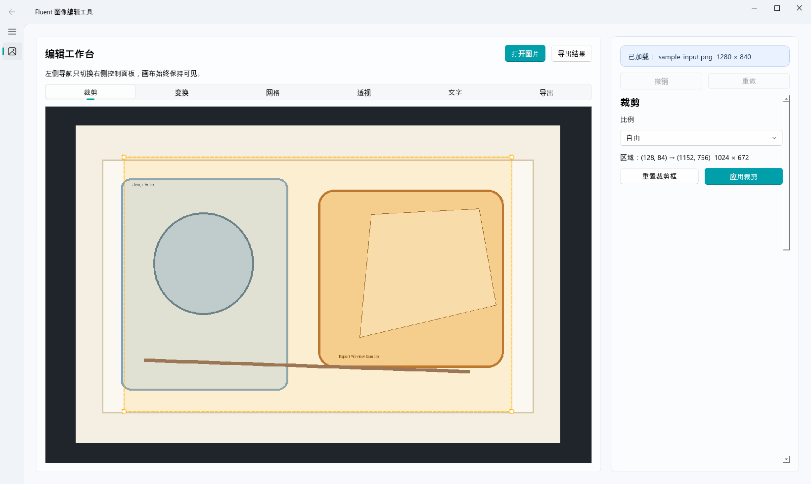
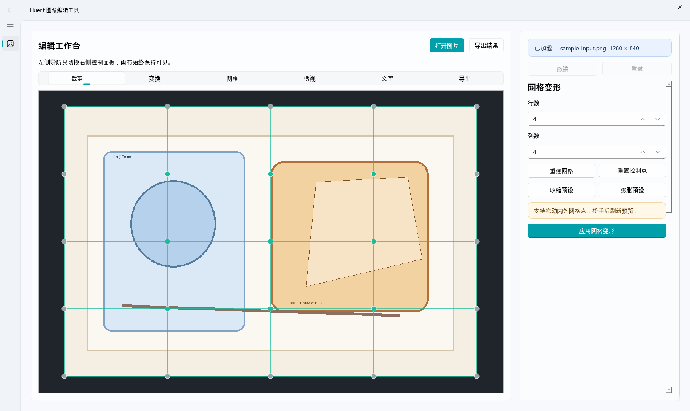
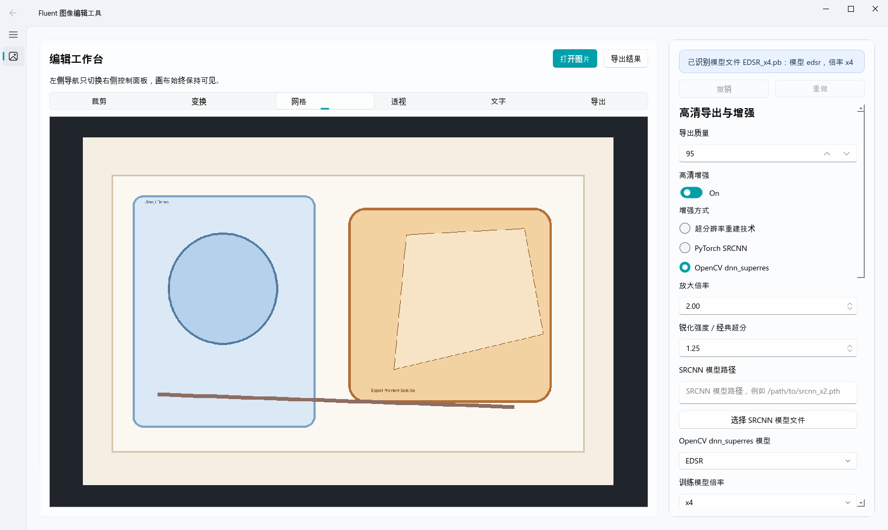

# FrameMorph-python

A desktop image editing tool built with `PySide6`, `Pillow`, and `OpenCV`.

[中文说明 / Chinese README](README.zh-CN.md)

`FrameMorph-python` is the repository project name, and `形绘` is the end-user desktop application name.

It focuses on practical image operations for local workflows:

- crop with fixed ratios or free selection
- resize, stretch, and rotate
- mesh warp
- perspective correction
- text overlays
- high-resolution export
- multiple enhancement paths, including OpenCV `dnn_superres`

## Features

- Drag-and-drop image loading
- Persistent right-side control panels with a visible canvas workspace
- Undo / redo support
- Real-time preview for mesh warp and perspective transform
- Export preview before / after enhancement
- Background export with progress, ETA, and cancel support
- OpenCV super-resolution model download support

## Tech Stack

- Python 3.11+
- PySide6
- Pillow
- OpenCV
- NumPy

## Project Structure

```text
FrameMorph-python/
├── main.py
├── core/
├── ui/
│   ├── main_window.py
│   ├── export_mixin.py
│   ├── export_support.py
│   └── transform_view.py
├── utils/
├── docs/
│   ├── TECHNICAL.md
│   └── USER_GUIDE.md
├── assets/
│   └── screenshots/
├── models/
│   └── opencv_dnn_superres/
├── VERSION
├── PROJECT_SUMMARY.md
└── requirements.txt
```

## Installation

```bash
pip install -r requirements.txt
```

## Run

```bash
python main.py
```

## Super-Resolution Support

The export workflow supports three enhancement routes:

1. Built-in classic super-resolution enhancement
2. PyTorch SRCNN with a custom local model path
3. OpenCV `dnn_superres` with:
   - EDSR
   - ESPCN
   - FSRCNN
   - LapSRN

The application can:

- auto-detect model type and scale from `.pb` filenames
- download supported OpenCV models into `models/opencv_dnn_superres/`
- show export progress with percentage and estimated remaining time

## Documentation

- Technical maintenance guide: [docs/TECHNICAL.md](docs/TECHNICAL.md)
- User guide: [docs/USER_GUIDE.md](docs/USER_GUIDE.md)
- Release metadata guide: [docs/RELEASE.md](docs/RELEASE.md)
- Packaging guide: [docs/PACKAGING.md](docs/PACKAGING.md)
- GitHub Actions Windows build: [docs/GITHUB_ACTIONS_WINDOWS_BUILD.md](docs/GITHUB_ACTIONS_WINDOWS_BUILD.md)
- Chinese release guide: [docs/RELEASE.zh-CN.md](docs/RELEASE.zh-CN.md)
- Project summary: [PROJECT_SUMMARY.md](PROJECT_SUMMARY.md)
- Changelog: [CHANGELOG.md](CHANGELOG.md)
- Windows portable build folder: [release/windows-portable](release/windows-portable)

## Screenshots

### Workbench



### Mesh Warp



### Export Panel



## Version

Current version: `0.1.0`

See [VERSION](VERSION).

## License

MIT License. See [LICENSE](LICENSE).
