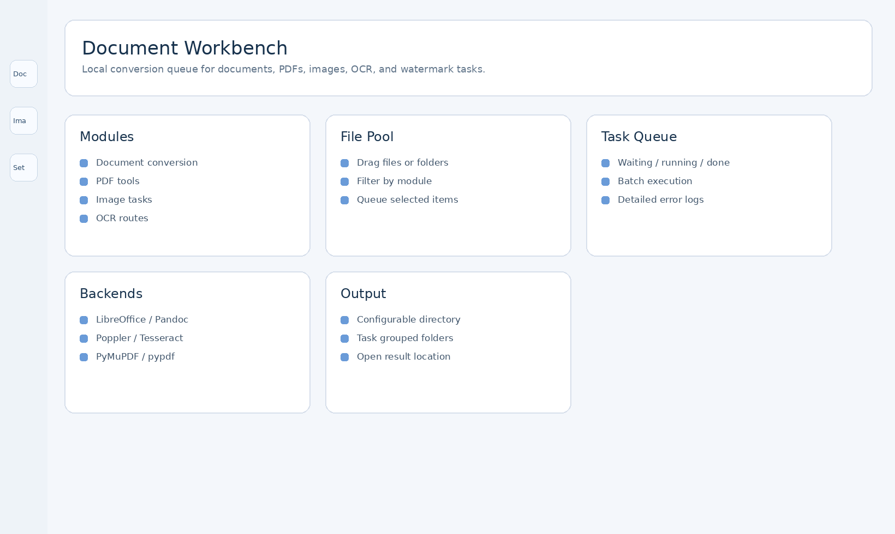
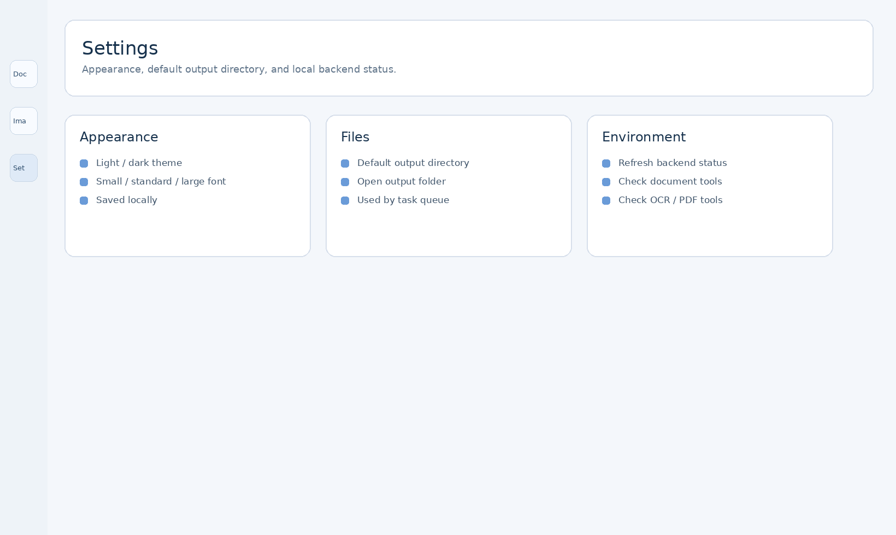

# FrameMorph-python

[](requirements.txt)
[](README.md)
[](LICENSE)
[](https://github.com/loker66fan/FrameMorph-python/actions/workflows/windows-portable-build.yml)

A local desktop toolkit for image editing, document conversion, PDF processing, OCR-oriented workflows, and high-resolution export, built with `PySide6`, `Pillow`, `OpenCV`, and Python document libraries.

[中文说明 / Chinese README](README.zh-CN.md)

`FrameMorph-python` is the repository name. `形绘` is the desktop application name shown to end users.

## Overview

This project is built for hands-on local file processing rather than cloud-first or template-heavy workflows.

- document workbench for Office, PDF, image, OCR, and watermark-related tasks
- image workbench for crop, resize, stretch, rotate, mesh warp, perspective correction, and text overlays
- task queues with status tracking, logs, batch execution, and a configurable output directory
- high-resolution image export with multiple enhancement paths, including OpenCV `dnn_superres`
- settings page for appearance, output location, and local backend status

## Screenshots

| Document Workbench | Image Workbench | Export Panel |
| --- | --- | --- |
|  |  |  |

| Mesh Warp | Settings |
| --- | --- |
|  |  |

## Quick Start

### Requirements

- Python 3.11+

### Install

```bash
pip install -r requirements.txt
```

For the Windows portable packaging flow, use the dedicated build dependency list:

```bash
pip install -r release/windows-portable/requirements-windows-build.txt
```

Normal development and application startup do not require `release/windows-portable/`, the offline `wheelhouse/`, or bundled installers.

### Run

```bash
python main.py
```

## Highlights

- First-level navigation for Document Workbench, Image Workbench, and Settings
- File pool and task queue for batch document, PDF, image, OCR, and watermark workflows
- Environment detection for LibreOffice, Pandoc, Poppler, Tesseract, FFmpeg, PyMuPDF, pypdf, python-docx, and openpyxl
- Drag-and-drop image loading
- Persistent image control panels with a visible canvas workspace
- Undo and redo support
- Real-time preview for mesh warp and perspective transform
- Export comparison preview before and after enhancement
- Background export with progress, ETA, and cancel support
- OpenCV super-resolution model download support

## Document Workbench

The document workbench provides a unified queue for local file operations:

- Office and markup conversion, including Office to PDF, PPT to images, Markdown / HTML / TXT conversion, and spreadsheet to CSV
- PDF tools for image export, split, merge, compression, rotation, encryption, decryption, OCR text extraction, and text watermark handling
- Image tools for image to PDF, format conversion, compression, crop, resize, and batch processing
- OCR routes for image / PDF to TXT, DOCX, XLSX, or searchable PDF where local OCR backends are available
- Watermark workflows for PDF text watermark removal and selected image repair / fill operations

Some features depend on local command-line tools. The app detects available backends and shows their status in the document workbench and settings page.

## Enhancement and Export

The export workflow currently supports three enhancement routes:

1. Built-in classic super-resolution enhancement
2. PyTorch SRCNN with a custom local model path
3. OpenCV `dnn_superres`

Supported OpenCV model families:

- EDSR
- ESPCN
- FSRCNN
- LapSRN

The application can:

- auto-detect model type and scale from `.pb` filenames
- download supported OpenCV models into `models/opencv_dnn_superres/`
- show export progress with percentage and estimated remaining time

## Optional Local Backends

Python dependencies are installed from `requirements.txt`. Some document workflows also use external tools when present:

- LibreOffice / `soffice` for Office conversion
- Pandoc for markup conversion
- Poppler tools such as `pdftoppm` and `pdfinfo` for PDF image export
- Tesseract for OCR fallbacks
- FFmpeg for future media-related extension points

## Repository Layout

```text
FrameMorph-python/
├── main.py
├── config/
├── core/
├── ui/
├── utils/
├── docs/
├── assets/
│   └── screenshots/
├── models/
│   └── opencv_dnn_superres/
├── scripts/
├── release/
│   └── windows-portable/
├── VERSION
├── CHANGELOG.md
├── PROJECT_SUMMARY.md
└── requirements.txt
```

## Documentation

- Technical maintenance guide: [docs/TECHNICAL.md](docs/TECHNICAL.md)
- User guide: [docs/USER_GUIDE.md](docs/USER_GUIDE.md)
- Release metadata guide: [docs/RELEASE.md](docs/RELEASE.md)
- Packaging guide: [docs/PACKAGING.md](docs/PACKAGING.md)
- GitHub Actions Windows build: [docs/GITHUB_ACTIONS_WINDOWS_BUILD.md](docs/GITHUB_ACTIONS_WINDOWS_BUILD.md)
- Chinese release guide: [docs/RELEASE.zh-CN.md](docs/RELEASE.zh-CN.md)
- Project summary: [PROJECT_SUMMARY.md](PROJECT_SUMMARY.md)
- Changelog: [CHANGELOG.md](CHANGELOG.md)
- Windows portable build folder: [release/windows-portable](release/windows-portable)

## Version

Current version: `0.2.0`

See [VERSION](VERSION).

## License

MIT License. See [LICENSE](LICENSE). Third-party libraries, command-line tools, and model files keep their own licenses.
